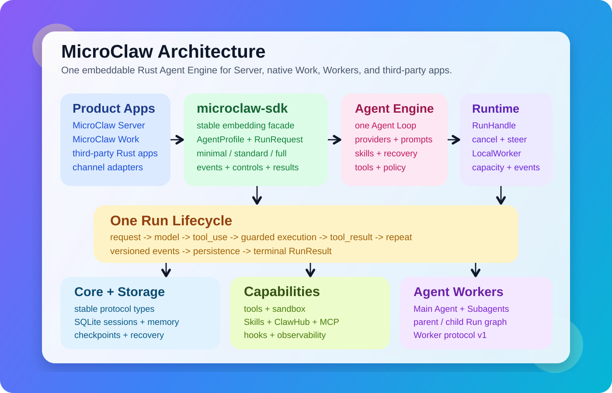

# MicroClaw


[English](README.md) · [简体中文](README_CN.md) · [हिन्दी](docs/i18n/README.hi.md) · [Español](docs/i18n/README.es.md) · [العربية](docs/i18n/README.ar.md) · [Français](docs/i18n/README.fr.md) · [বাংলা](docs/i18n/README.bn.md) · [Português](docs/i18n/README.pt.md) · [Bahasa Indonesia](docs/i18n/README.id.md) · [اردو](docs/i18n/README.ur.md)

> [!IMPORTANT]
> 生产环境请使用 [`stable`](https://github.com/microclaw/microclaw/tree/stable) 分支。`main` 更新频繁，可能包含破坏性变更。

[](https://microclaw.org)
[](https://github.com/microclaw/microclaw/releases/latest)
[](https://discord.gg/pvmezwkAk5)
[](https://www.reddit.com/r/microclaw/)
[](LICENSE)

<p align="center">
  
</p>

<p align="center">
  <strong>一套共享 Rust 智能体内核，两种产品形态。</strong><br />
  MicroClaw Server 面向持续运行的渠道与自动化，MicroClaw Work 面向原生桌面工作空间。
</p>

<p align="center">
  <a href="#快速开始">快速开始</a> ·
  <a href="#为什么选择-microclaw">为什么选择</a> ·
  <a href="#能力地图">能力地图</a> ·
  <a href="#文档">文档</a>
</p>

MicroClaw 是一个用 Rust 编写、可自行托管的智能体平台，包含两种产品形态。**MicroClaw Server** 持续运行，承载聊天渠道、Web、API、调度和自动化；**MicroClaw Work** 是面向本地项目工作的原生 GPUI 桌面应用。两者共享同一套渠道无关 Agent Engine、provider 抽象、工具、安全策略、记忆、技能和运行时事件。

它面向的不只是一次问答，而是能够持续完成的工作：多步工具调用、可恢复会话、可靠投递、持久记忆、定时任务和受治理的扩展能力都运行在同一个系统中。

| 产品 | 适用场景 | 当前支持 |
|---|---|---|
| MicroClaw Server | 常驻智能体、聊天渠道、Web/API、定时任务与远程自动化 | macOS、Linux 和 Windows |
| MicroClaw Work | 原生本地对话、项目工作空间、工具审批、检查点与桌面设置 | Apple Silicon macOS 13+；Linux/Windows portable 预览包 |

<p align="center">
  
  &nbsp;&nbsp;
  
</p>

## 快速开始

在 Apple Silicon macOS 13+ 上安装原生 MicroClaw Work：

```sh
brew tap microclaw/tap
brew install --cask microclaw-work
```

Linux x86_64/arm64 与 Windows x86_64 portable 预览包可从
[v0.5.3 版本页面](https://github.com/microclaw/microclaw/releases/tag/v0.5.3)下载。
macOS 仍是 Work 当前正式支持的桌面平台，其他平台继续完成验收。

如需运行 MicroClaw Server，在 macOS 或 Linux 上安装：

```sh
curl -fsSL https://microclaw.org/install.sh | bash
```

Windows PowerShell 安装：

```powershell
iwr https://microclaw.org/install.ps1 -UseBasicParsing | iex
```

配置并启动：

```sh
microclaw doctor
microclaw setup
microclaw start
```

然后打开 [http://127.0.0.1:10961](http://127.0.0.1:10961)。

最新版本为 **v0.5.3**，包含修正后的 MicroClaw Work 品牌图标、Server + Work 架构说明，以及 Linux 和 Windows 的 Work portable 预览包，同时完整保留 Server 运行时能力。详情见[更新日志](CHANGELOG.md)与[版本下载](https://github.com/microclaw/microclaw/releases/tag/v0.5.3)。

Homebrew、Docker、源码构建、Linux 兼容性、升级和常驻服务安装请查看[快速上手指南](docs/getting-started.md)。

## 为什么选择 MicroClaw

- **一套内核，两种产品形态。** Server 与 Work 共享同一套 Agent Engine、provider 层、工具、记忆、安全策略和恢复模型。
- **执行可以持续。** 会话、安全工具边界、定时任务和消息投递都可以在进程重启后继续。
- **不绑定模型提供商。** 原生支持 Anthropic，并通过统一内部消息模型兼容大量 OpenAI-compatible 和本地服务。
- **扩展边界清晰。** 技能、MCP Server、插件、Hook、工具和渠道适配器都能独立扩展，无需替换核心运行时。
- **适合轻量部署。** Rust 服务配合内嵌 SQLite，无需独立向量数据库或复杂服务网格。
- **安全能力贯穿执行链路。** 工具风险确认、细粒度授权、出口控制、沙箱、脱敏和审计统一在共享边界执行。

### 可以验证的可靠性

| 场景 | MicroClaw 的保证 | 验证方式 |
|---|---|---|
| 回复超过渠道长度限制 | 先持久化接收完整回复，再按顺序分片；重试不会丢失边界字节 | `microclaw doctor delivery` |
| 进程在模型与工具步骤之间退出 | provider 无关检查点会恢复已完成工作，不重复执行已完成的工具结果 | `/status` 或 Web Governance |
| 可写工具执行时被中断 | 面对不确定的副作用会停止并要求核验，不会盲目重放 | 恢复审计事件 |
| 渠道暂时不可用 | 任务完成与消息投递分开记录，结果可以保留在队列中重试 | 任务历史与投递诊断 |

具体恢复模型见 [Durable Coworker 指南](docs/operations/durable-coworker.md)和[可靠性证明报告](docs/reports/reliability-differentiation-2026-07.md)。每个版本都会发布机器可读的[可靠性评分](docs/reports/reliability/README.md)，也可以用 `scripts/ci/reliability_scorecard.sh` 在本地复现。

## 工作原理

每条消息都走同一条执行链路：

1. 恢复会话，并加载相关记忆、技能和运行时上下文。
2. 使用 provider 无关的消息与工具定义调用所选模型。
3. 通过统一的安全策略、Hook 和授权检查执行工具。
4. 循环至完成，持久化本轮状态，再可靠投递结果。

<p align="center">
  
</p>

Server 渠道适配器只负责输入转换和结果投递；Work 通过 `microclaw-work-runtime` 与 `microclaw-work-app` 把同一套运行时事件投影成原生 GPUI 状态。两种产品形态都不维护独立的 agent loop，也不重复实现 provider 逻辑。

## 能力地图

| 领域 | 主要能力 | 深入阅读 |
|---|---|---|
| 智能体执行 | 多步工具、只读工具并行、计划、进度更新、完成契约与子智能体 | [工具目录](docs/generated/tools.md)、[完成契约](docs/completion-contracts.md) |
| 连续性 | 会话恢复、上下文压缩、检查点、可靠投递、定时任务和取消 | [并发模型](docs/operations/concurrency-and-responsiveness.md)、[任务生命周期](docs/scheduled-task-lifecycle.md) |
| 记忆与学习 | 文件和 SQLite 记忆、语义召回、时序知识图谱、经验凭证与受治理的技能演化 | [长期学习](docs/long-horizon-learning.md)、[Learning Foundry](docs/learning-foundry.md) |
| 扩展 | 技能、Manifest 插件、Hook、MCP、ClawHub、A2A 与 ACP | [插件](docs/plugins/overview.md)、[MCP](docs/integrations/mcp.md)、[ClawHub](docs/clawhub/overview.md)、[A2A](docs/a2a.md) |
| 交互入口 | 原生 MicroClaw Work、本地 Web UI、HTTP/SSE/WebSocket API、聊天渠道与智能体协议 | [Work 发布](docs/operations/microclaw-work-release.md)、[Web UI](docs/operations/web-ui.md)、[HTTP 触发](docs/operations/http-hook-trigger.md)、[ACP](docs/operations/acp-stdio.md) |
| 安全与运维 | 工具确认、能力授权、Docker 沙箱、出口策略、凭证脱敏、指标、链路追踪与诊断 | [执行模型](docs/security/execution-model.md)、[安全运行时](docs/security/secure-runtime.md)、[运维手册](docs/operations/runbook.md) |

### 渠道与模型提供商

运行时包含 Telegram、Discord、Slack、飞书/Lark、微信、钉钉、QQ、WhatsApp、Signal、Matrix、IRC、Nostr、iMessage、电子邮件和 Web 等适配器。Matrix 由 `full` feature 启用；不同平台的可用性和设置要求有所不同。

Anthropic 使用原生 provider 通路。OpenAI、OpenAI Codex、OpenRouter、Ollama、Google、DeepSeek、本地推理服务等通过统一的 OpenAI-compatible 通路接入。当前 provider ID、协议、默认地址和模型请以[自动生成的 provider 矩阵](docs/generated/provider-matrix.md)为准。

## 安装方式

| 方式 | 适用场景 | 命令或入口 |
|---|---|---|
| 安装脚本 | 最快完成 macOS/Linux 安装 | `curl -fsSL https://microclaw.org/install.sh \| bash` |
| PowerShell | 最快完成 Windows 安装 | `iwr https://microclaw.org/install.ps1 -UseBasicParsing \| iex` |
| Homebrew | 在 macOS 上管理升级 | `brew tap microclaw/tap && brew install microclaw` |
| Homebrew Cask | Apple Silicon macOS 13+ 原生 MicroClaw Work | `brew tap microclaw/tap && brew install --cask microclaw-work` |
| 容器 | 隔离部署 | `ghcr.io/microclaw/microclaw:latest` |
| 源码 | 开发或启用自定义 feature | `cargo build --release` |

预编译 Linux 二进制对 glibc 和 OpenSSL 有版本要求。旧发行版安装前请先阅读[快速上手指南](docs/getting-started.md)。

MicroClaw Work 当前正式支持 Apple Silicon macOS；Linux 和 Windows portable 预览包随每个版本自动发布，原生平台验收仍在继续。MicroClaw Server 继续支持这三个平台。

## 文档

建议从[文档导航](docs/README.md)开始。文档按日常使用、扩展、运维、安全、架构和贡献者内容分层，让 README 只承担清晰的项目入口职责。

| 需求 | 事实来源 |
|---|---|
| 安装、配置和运行 | [快速上手](docs/getting-started.md) |
| 查看常见示例 | [Cookbook](docs/cookbook.md) |
| 查看所有内置工具 | [自动生成的工具目录](docs/generated/tools.md) |
| 核对配置默认值 | [自动生成的配置默认值](docs/generated/config-defaults.md)和 [`microclaw.config.example.yaml`](microclaw.config.example.yaml) |
| 运维运行时 | [运维手册](docs/operations/runbook.md) |
| 部署安全运行时 | [安全指南](docs/security/secure-runtime.md) |
| 开发或贡献 | [开发指南](DEVELOP.md)和[贡献指南](CONTRIBUTING.md) |
| 验证改动 | [测试指南](TEST.md) |
| 查看发布变化 | [更新日志](CHANGELOG.md)和[升级指南](docs/releases/upgrade-guide.md) |

各语言 README 提供项目概览和快速开始。为了让命令与配置事实只有一个可维护来源，英文技术文档是权威版本。详见[翻译维护策略](docs/i18n/README.md)。

## 社区与贡献

欢迎在 [Discord](https://discord.gg/pvmezwkAk5) 和 [Reddit](https://www.reddit.com/r/microclaw/) 交流问题与想法。提交 Issue 或代码前请阅读 [CONTRIBUTING.md](CONTRIBUTING.md)；安全问题请按 [SECURITY.md](SECURITY.md) 私下报告。

## Star History

[](https://star-history.dera.page/#microclaw/microclaw&Date)

## Contributors

感谢所有为 MicroClaw 做出贡献的人。

[](https://github.com/microclaw/microclaw/graphs/contributors)

## 许可证

[MIT](LICENSE)
